	

# Hi there, I'm Manuel 👋

## 🚀 About Me

- 💻 Passionate about C, C++, C#, Python and Linux development
- 🔧 Embedded systems and STM32 enthusiast
- 🧩 Interested in hardware design, electronics and system architecture
- 🤖 Interested in AI, RAG systems and local LLMs
- 🎵 Listening to Drum & Bass and Trance music

---

## 🛠️ Technologies & Tools

---

<table align="center" cellspacing="0" cellpadding="3">
	<tr>
		<td>
			
		</td>
	</tr>
</table>

---

	<b>Open to interesting projects in Embedded Systems and AI</b> 
	Code. Build. Improve.

