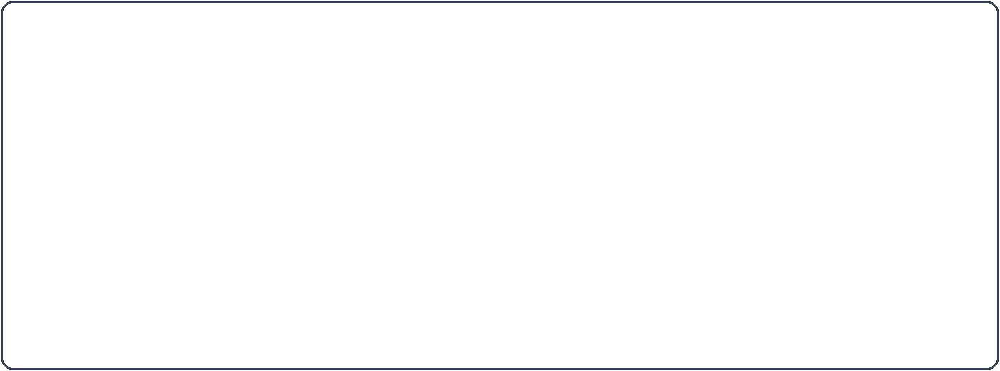
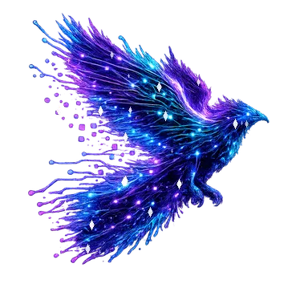

	

# Hi there, I'm Manuel 👋

	

## 🚀 About Me

- 💻 Passionate about C, C++, C#, Python and Linux development
- 🔧 Embedded systems and STM32 enthusiast
- 🧩 Interested in hardware design, electronics and system architecture
- 🤖 Interested in AI, RAG systems and local LLMs
- 🎵 Listening to Drum & Bass and Trance music

## 🛠️ Technologies & Tools

## 🤖 AI Chat Intro

	

## ✨ Visual Vibe

	

	

	<b>RegexCore Signature Visual</b> 
	Bold motion. Clean composition.

---

	<b>Open to interesting projects in Embedded Systems and AI</b> 
	Code. Build. Improve.

